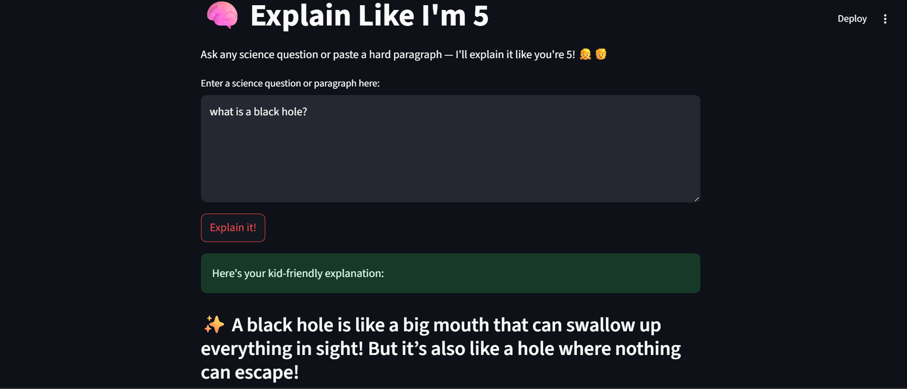
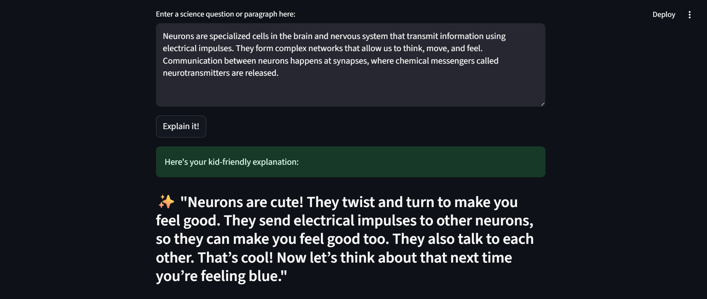

# 🧠 Explain Like I'm 5

A fun and interactive Streamlit app that explains complex science topics like you're five years old! Powered by TinyLlama and `llama-cpp-python`, this app transforms long, complicated science text and questions into short, silly, and easy-to-understand answers — just like a friendly kindergarten teacher would.

---

## ✨ Features

- 💬 Ask a complex science question or paste a technical paragraph
- 🤓 Get adorable, fun, and 5-year-old-friendly answers
- 🧠 Powered by the efficient [TinyLlama-1.1B-Chat](https://huggingface.co/cognitivecomputations/TinyLlama-1.1B-Chat-v1.0-GGUF)
- 💻 Runs locally — no API keys or internet required
- ✅ Ideal for educators, kids, and science communicators!

---

## 🖼️ Screenshots

### 🟢 Example 1 – Short Question
Ask something like:
> **"What is a black hole?"**



---

### 🟣 Example 2 – Scientific Paragraph
Paste something like:
> "Neurons are specialized cells in the brain and nervous system that transmit information using electrical impulses...."

And get:
> **"Neurons are cute! They twist and turn to make you feel good.!"**



---

## 🚀 Getting Started

### 🔧 Installation

1. Clone this repository:
   ```bash
   git clone https://github.com/your-username/explain-like-im-5.git
   cd explain-like-im-5
